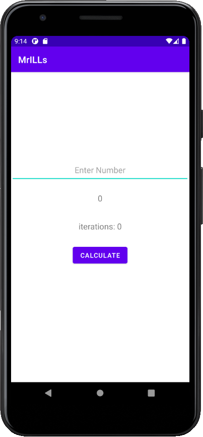
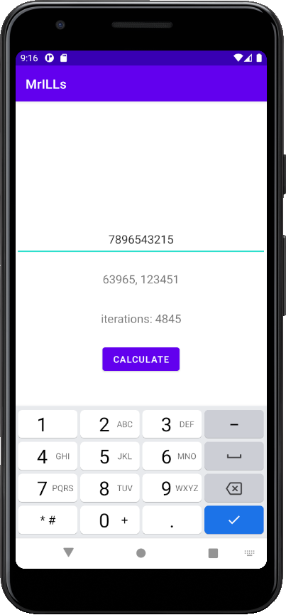

### Lab 3.1 Protocol
```kotlin
fun formatResult(num1: Long, num2: Long): String {
    return "${num1.toString()}, ${num2.toString()}"
}

fun fermaFactors(n: Long): String {
    if(n <= 0) {
        return n.toString()
    }

    if(n % 2 == 0L) {
        return formatResult(n/2, n)
    }

    var a: Long = ceil(sqrt(n.toDouble())).toLong()
    if(a * a == n) {
        return formatResult(a, a)
    }

    var b: Long
    while(true) {
        val b1: Long = a * a - n
        b = sqrt(b1.toDouble()).toLong()
        if(b * b == b1) {
            break
        } else {
            a += 1
        }
    }
    return formatResult(a - b, a + b)
}
```

### Screenshots




