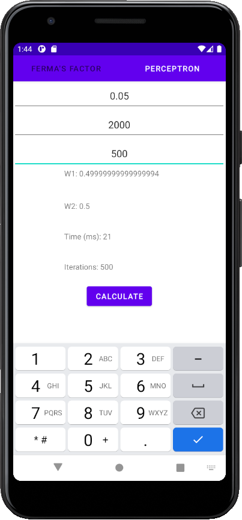

### Lab 3.2 Protocol
```kotlin
class PerceptronClass {
    var p: Int = 4
    var lRate: Double = 0.001

    var w1: Double = 0.0
    var w2: Double = 0.0

    private val bias: Int = 1

    private fun yCalc(x: Double, y: Double): Double {
        return this.w1 * x + this.w2 * y + this.bias
    }

    private fun deltaCalc(y: Double): Double {
        return this.p.toDouble() - y
    }

    private fun wCalc(x: Double, y: Double, delta: Double) {
        this.w1 += delta * x * this.lRate;
        this.w2 += delta * y * this.lRate;
    }

    data class PerceptronClassResult(val w1: Double, val w2: Double, val time: Long, val iter: Int)
    fun learn(input: Array<Pair<Double, Double>>, maxIterations: Int, maxTime: Long): PerceptronClassResult{
        var iterations: Int = 0

        val startTime: Long = System.currentTimeMillis()
        var currentTime: Long = System.currentTimeMillis()
        val deadlineTime: Long = startTime + maxTime

        while (maxIterations > iterations && currentTime < deadlineTime) {
            input.forEach() lit@{ p ->
                val y = this.yCalc(p.first, p.second)
                val delta = this.deltaCalc(y)
                this.wCalc(p.first, p.second, delta)
            }

            currentTime = System.currentTimeMillis()
            iterations++
        }
        currentTime = System.currentTimeMillis()
        return PerceptronClassResult(this.w1, this.w2, currentTime - startTime, iterations)
    }
}

```

### Screenshots





